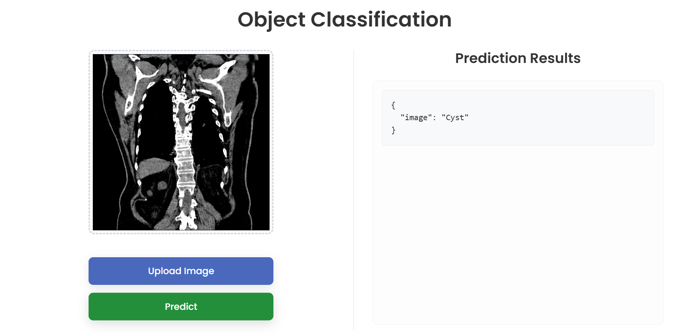
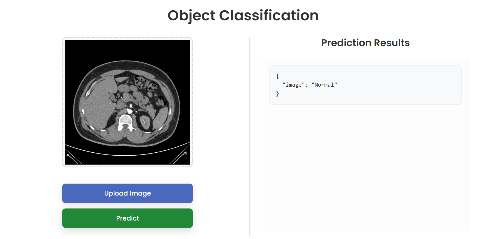
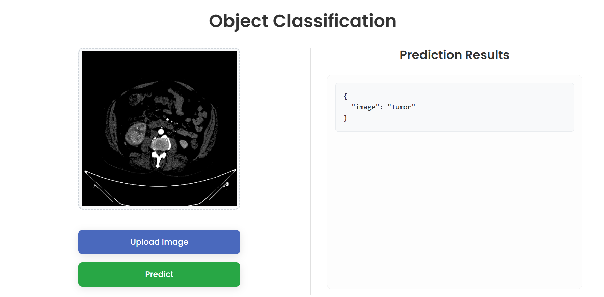

#  RenalTumor – Kidney Image Classification

**RenalTumor** is an end-to-end Machine Learning application that classifies kidney CT images into three categories: **Cyst**, **Normal**, and **Tumor**.  
It incorporates full **MLOps workflow** with **DVC**, serves predictions via a **Flask web app**, and is containerized using **Docker** for easy deployment.

---

## 📊 Sample Classifications

| Cyst | Normal | Tumor |
|:----:|:------:|:-----:|
|  |  |  |

---

## ✨ Features

✅ **End-to-End Pipeline** – Covers everything from data ingestion to model deployment  
✅ **Version Control with DVC** – Ensures reproducibility for both data and models  
✅ **Web Interface** – Upload images and receive predictions using a sleek UI  
✅ **Dockerized Deployment** – Portable, scalable, and cloud-ready  
✅ **Clean Codebase** – Modular architecture that follows industry best practices  

---

## ⚙️ Tech Stack

| Layer          | Tools/Frameworks                            |
|----------------|---------------------------------------------|
| **Backend**    | Python, Flask                               |
| **ML/DL**      | TensorFlow, Keras                           |
| **MLOps**      | DVC (Data Version Control)                  |
| **Frontend**   | HTML, CSS, JavaScript                       |
| **Deployment** | Docker                                      |

---

## 📁 Project Structure

```
RenalTumor/
├── .dvc/                  # DVC metadata files

├── artifacts/             # Pipeline outputs: datasets, models, etc.

├── config/                # YAML/JSON config files

├── DemoImages/            # Sample CT images

├── logs/                  # Pipeline and application logs

├── research/              # Jupyter notebooks for experimentation

├── src/                   # Source code for training and prediction

├── templates/             # HTML templates for the Flask app

├── venv/                  # Virtual environment (local)

├── .dvcignore             # Files/folders ignored by DVC

├── app.py                 # Flask web app entry point

├── Dockerfile             # Docker build configuration

├── dvc.yaml               # DVC pipeline definitions

├── main.py                # Training pipeline trigger

├── params.yaml            # All tunable parameters

├── requirements.txt       # Project dependencies

├── setup.py               # Package setup script

```

---

## 🚀 Getting Started

### 🔧 Prerequisites

Ensure the following are installed:

- [Python 3.8+](https://www.python.org/)
- [Git](https://git-scm.com/)
- [DVC](https://dvc.org/doc/install)
- [Docker (Optional)](https://www.docker.com/get-started)

---

### 📦 Installation

1. **Clone the repository**
```bash
git clone https://github.com/YOUR_USERNAME/renal-tumor.git
cd renal-tumor
```

2. **Create and activate a virtual environment**

- On **Windows**:
```bash
python -m venv venv
venv\Scripts\activate
```

- On **macOS/Linux**:
```bash
python3 -m venv venv
source venv/bin/activate
```

3. **Install Python dependencies**
```bash
pip install -r requirements.txt
```

4. **Pull versioned data and model from DVC remote**
```bash
dvc pull
```

---

## 🧪 Running the Project

### ⚙️ 1. Reproduce the Full DVC Pipeline

This runs all stages: data preparation → model training → evaluation.
```bash
dvc repro
```

### 🌐 2. Launch the Flask Web Application

```bash
python app.py
```

Visit your browser at: [http://localhost:8080](http://localhost:8080)

---

## 🐳 Docker Deployment (Optional)

To build and run the container:
```bash
docker build -t renal-tumor-app .
docker run -p 8080:8080 renal-tumor-app
```

---

## 🤝 Contributing

We welcome contributions from the community!  
Follow these steps to contribute:

```bash
# 1. Fork the repository
# 2. Clone your fork
git clone https://github.com/YOUR_USERNAME/renal-tumor.git

# 3. Create a new branch
git checkout -b feature/my-awesome-feature

# 4. Make your changes & commit
git commit -m "feat: Add my awesome feature"

# 5. Push to your fork
git push origin feature/my-awesome-feature

# 6. Open a Pull Request
```

---

## 🛡️ License

This project is licensed under the **MIT License** – see the [LICENSE](LICENSE) file for details.

---
