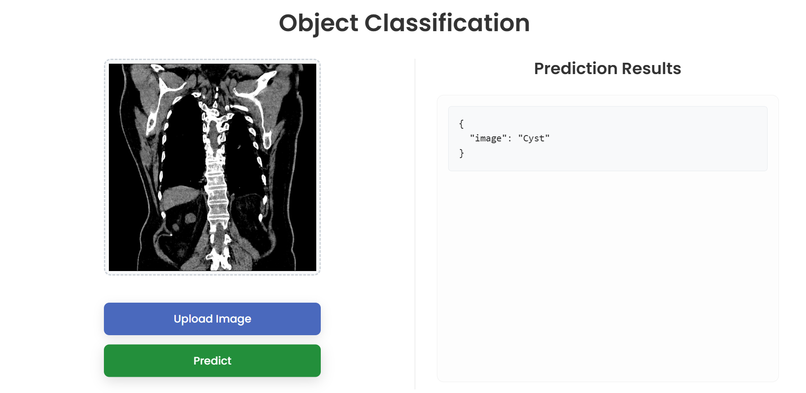
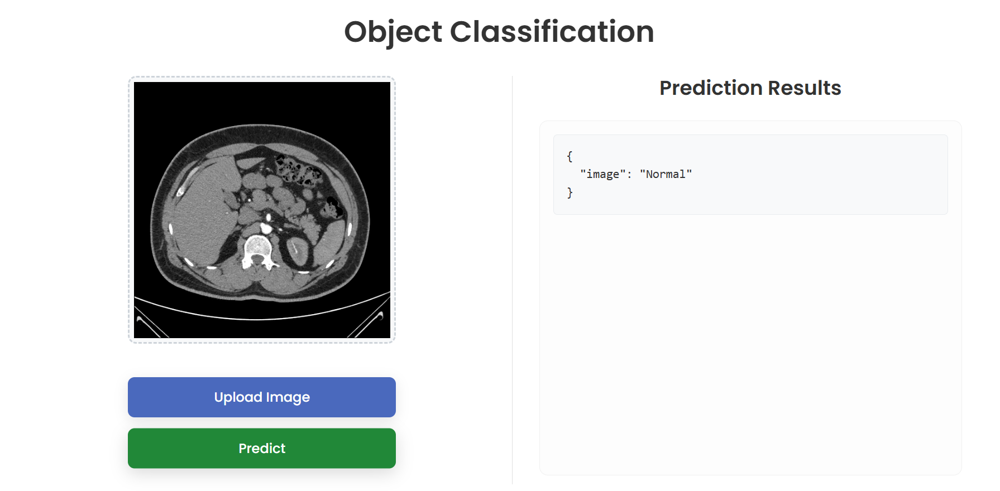
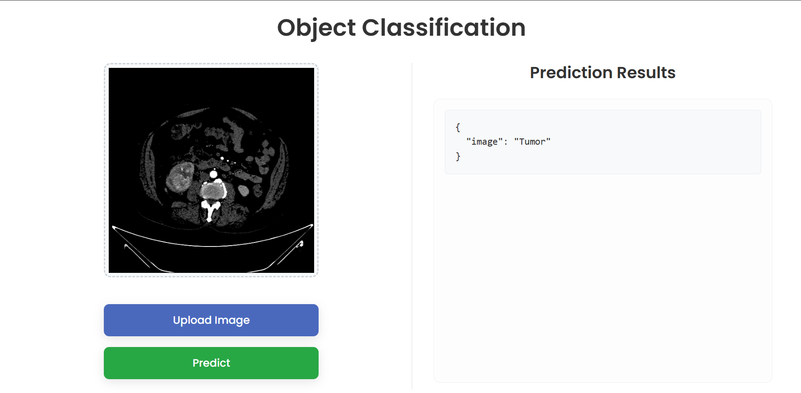

#  RenalTumor – Kidney Image Classification

**RenalTumor** is an end-to-end Machine Learning application that classifies kidney CT images into three categories: **Cyst**, **Normal**, and **Tumor**.  
It incorporates full **MLOps workflow** with **DVC**, serves predictions via a **Flask web app**, and is containerized using **Docker** for easy deployment.

---

## 📊 Sample Classifications

| Cyst | Normal | Tumor |
|:----:|:------:|:-----:|
|  |  |  |

---

## ✨ Features

✅ **End-to-End Pipeline** – Covers everything from data ingestion to model deployment  
✅ **Version Control with DVC** – Ensures reproducibility for both data and models  
✅ **Web Interface** – Upload images and receive predictions using a sleek UI  
✅ **Dockerized Deployment** – Portable, scalable, and cloud-ready  
✅ **Clean Codebase** – Modular architecture that follows industry best practices  

---

## ⚙️ Tech Stack

| Layer          | Tools/Frameworks                            |
|----------------|---------------------------------------------|
| **Backend**    | Python, Flask                               |
| **ML/DL**      | TensorFlow, Keras                           |
| **MLOps**      | DVC (Data Version Control)                  |
| **Frontend**   | HTML, CSS, JavaScript                       |
| **Deployment** | Docker                                      |

---

## 📁 Project Structure

```
RenalTumor/
├── .dvc/                  # DVC metadata files

├── artifacts/             # Pipeline outputs: datasets, models, etc.

├── config/                # YAML/JSON config files

├── DemoImages/            # Sample CT images

├── logs/                  # Pipeline and application logs

├── research/              # Jupyter notebooks for experimentation

├── src/                   # Source code for training and prediction

├── templates/             # HTML templates for the Flask app

├── venv/                  # Virtual environment (local)

├── .dvcignore             # Files/folders ignored by DVC

├── app.py                 # Flask web app entry point

├── Dockerfile             # Docker build configuration

├── dvc.yaml               # DVC pipeline definitions

├── main.py                # Training pipeline trigger

├── params.yaml            # All tunable parameters

├── requirements.txt       # Project dependencies

├── setup.py               # Package setup script

```

---

## 🚀 Getting Started

### 🔧 Prerequisites

Ensure the following are installed:

- [Python 3.8+](https://www.python.org/)
- [Git](https://git-scm.com/)
- [DVC](https://dvc.org/doc/install)
- [Docker (Optional)](https://www.docker.com/get-started)

---

### 📦 Installation

1. **Clone the repository**
```bash
git clone https://github.com/YOUR_USERNAME/renal-tumor.git
cd renal-tumor
```

2. **Create and activate a virtual environment**

- On **Windows**:
```bash
python -m venv venv
venv\Scripts\activate
```

- On **macOS/Linux**:
```bash
python3 -m venv venv
source venv/bin/activate
```

3. **Install Python dependencies**
```bash
pip install -r requirements.txt
```

4. **Pull versioned data and model from DVC remote**
```bash
dvc pull
```

---

## 🧪 Running the Project

### ⚙️ 1. Reproduce the Full DVC Pipeline

This runs all stages: data preparation → model training → evaluation.
```bash
dvc repro
```

### 🌐 2. Launch the Flask Web Application

```bash
python app.py
```

Visit your browser at: [http://localhost:8080](http://localhost:8080)

---

## 🤝 Contributing

We welcome contributions from the community!  
Follow these steps to contribute:

```bash
# 1. Fork the repository
# 2. Clone your fork
git clone https://github.com/kanishka-rani-2005/renal-tumor.git

# 3. Create a new branch
git checkout -b feature/my-awesome-feature

# 4. Make your changes & commit
git commit -m "feat: Add my awesome feature"

# 5. Push to your fork
git push origin feature/my-awesome-feature

# 6. Open a Pull Request
```


# AWS CI/CD Deployment with GitHub Actions

This guide explains how to deploy a Dockerized application to AWS EC2 using GitHub Actions and Amazon ECR.

---

## Architecture

```text
GitHub Repository
        │
        ▼
GitHub Actions
        │
        ▼
Build Docker Image
        │
        ▼
Push Image to Amazon ECR
        │
        ▼
EC2 Self-Hosted Runner
        │
        ▼
Pull Latest Image from ECR
        │
        ▼
Run Docker Container
```

---

# Step 1: Login to AWS Console

1. Open AWS Management Console.
2. Login with your AWS account credentials.
3. Select your preferred AWS Region.

---

# Step 2: Create IAM User for Deployment

Create an IAM user with programmatic access.

## Required Services

### EC2
Used to host and run your application.

### ECR (Elastic Container Registry)
Used to store Docker images.

---

## Deployment Flow

1. Build Docker image from source code.
2. Push Docker image to Amazon ECR.
3. Launch EC2 instance.
4. Pull Docker image from ECR.
5. Run Docker container on EC2.

---

## Required IAM Policies

Attach the following policies to the IAM user:

```text
AmazonEC2ContainerRegistryFullAccess
AmazonEC2FullAccess
```

---

## Create Access Keys

After creating the IAM user:

```text
IAM → Users → Select User → Security Credentials
→ Create Access Key
```

Save:

```text
AWS_ACCESS_KEY_ID
AWS_SECRET_ACCESS_KEY
```

---

# Step 3: Create ECR Repository

Navigate to:

```text
AWS Console
→ Elastic Container Registry (ECR)
→ Create Repository
```

Example Repository URI:

```text
970547337635.dkr.ecr.ap-south-1.amazonaws.com/mlproj
```

Save this URI for later use.

---

# Step 4: Launch EC2 Instance

Create an Ubuntu EC2 instance.

Recommended:

```text
AMI: Ubuntu 22.04 LTS
Instance Type: t2.micro (Free Tier)
Storage: 20 GB
```

Security Group:

```text
SSH   : 22
HTTP  : 80
HTTPS : 443
App Port (optional): 5000 / 8000
```

---

# Step 5: Install Docker on EC2

Connect to EC2:

```bash
ssh -i key.pem ubuntu@<EC2_PUBLIC_IP>
```

Update packages:

```bash
sudo apt-get update -y
sudo apt-get upgrade -y
```

Install Docker:

```bash
curl -fsSL https://get.docker.com -o get-docker.sh

sudo sh get-docker.sh

sudo usermod -aG docker ubuntu

newgrp docker
```

Verify Docker installation:

```bash
docker --version
```

---

# Step 6: Configure EC2 as GitHub Self-Hosted Runner

Go to:

```text
GitHub Repository
→ Settings
→ Actions
→ Runners
→ New Self-Hosted Runner
```

Select:

```text
Linux
x64
```

Run the commands provided by GitHub on your EC2 machine.

Example:

```bash
mkdir actions-runner && cd actions-runner

curl -o actions-runner-linux-x64.tar.gz -L <runner-url>

tar xzf ./actions-runner-linux-x64.tar.gz

./config.sh --url https://github.com/<username>/<repo> --token <token>

./run.sh
```

---

# Step 7: Configure GitHub Secrets

Navigate to:

```text
GitHub Repository
→ Settings
→ Secrets and Variables
→ Actions
```

Create the following secrets:

```text
AWS_ACCESS_KEY_ID = ****************

AWS_SECRET_ACCESS_KEY = ****************

AWS_REGION = ap-south-1

AWS_ECR_LOGIN_URI = 970547337635.dkr.ecr.ap-south-1.amazonaws.com

ECR_REPOSITORY_NAME = mlproj
```

---


## 👨‍💻 Author

**Kanishka Bansal**

B.Tech Computer Science Engineering

Thapar Institute of Engineering and Technology

---


## 🛡️ License

This project is licensed under the **MIT License** – see the [LICENSE](LICENSE) file for details.

---
